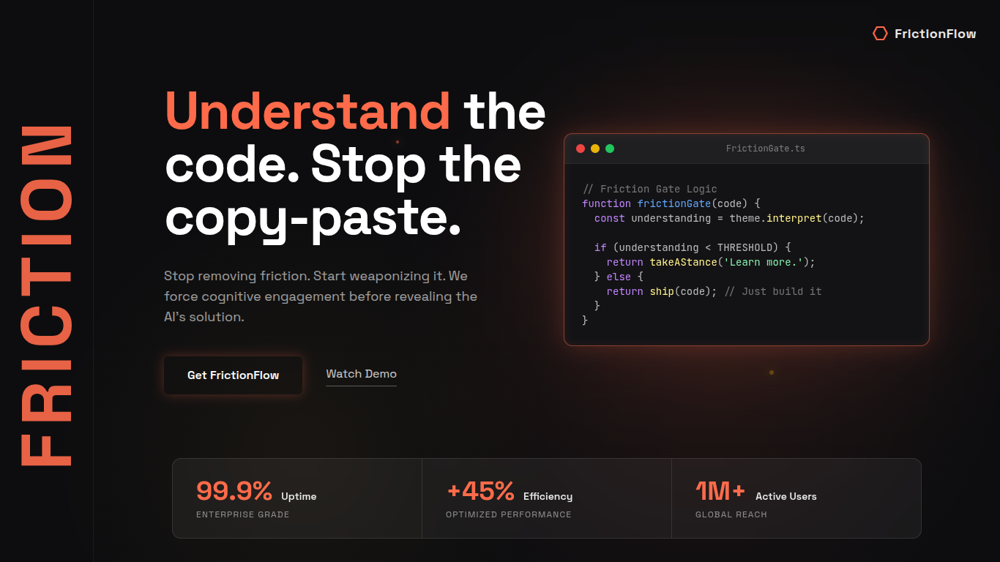

<div align="center">
   
</div>

<p align="center">
   <a href="#why-it-exists"></a>
   <a href="#what-it-does"></a>
   <a href="#site-overview"></a>
   <a href="#local-setup"></a>
   <a href="#api"></a>
</p>

# FrictionFlow

FrictionFlow is a VS Code-inspired cognitive developer assistant that turns debugging into a structured, friction-first workflow. It treats friction as a signal to understand, not something to erase, and guides users through analysis before revealing a solution.

## Why It Exists

The hackathon theme is simple: one word, infinite interpretations. FrictionFlow takes a position by turning debugging into a structured investigation. It explains what is likely wrong, surfaces friction points, and only unlocks the solution after the user has worked through the problem first.

## What It Does

- Presents a VS Code-style workspace with explorer, analysis, search, and settings views.
- Opens source and test files in tabs and keeps paired files linked together.
- Sends code to a server-side OpenRouter pipeline and returns structured analysis data.
- Shows an AI-generated diff and markdown summary when a solution is unlocked.
- Supports starter files for JavaScript, TypeScript, Python, HTML, CSS, and Go.

## Site Overview

- Landing page with a bold hero message, live product screenshot, and calls to action that frame the app as a friction-first coding tool.
- VS Code-style workspace with a left activity rail, resizable explorer, search, analysis, and settings views, plus a main editor pane.
- Paired source and test files so the workspace keeps implementation and verification side by side.
- Context-aware analysis flow that accepts extra user notes before sending code to the AI backend.
- Locked solution experience that shows an AI-generated diff and markdown summary before letting users apply the fix.
- Mobile warning banner for smaller screens so the editor experience stays intentional.

## Project Facts

- Built for the FRICTION hackathon theme: "Stop removing it. Start understanding it."
- Supports starter files for JavaScript, TypeScript, Python, HTML, CSS, and Go.
- Uses OpenRouter on the server so API keys stay out of the frontend.
- Includes a local dev server, frontend build, lint, and format scripts for day-to-day development.
- The hero image in this README is the same visual identity used for the project banner.

## Tech Stack

- React 19
- Vite
- TypeScript
- Tailwind CSS 4
- Express
- CodeMirror 6
- OpenRouter

## Local Setup

**Prerequisites:** Node.js

1. Install dependencies:
   `npm install`
2. Create [.env.local](.env.local) with your OpenRouter credentials:

   ```env
   OPENROUTER_API_KEY=your_key_here
   OPENROUTER_MODEL=openai/gpt-4o-mini
   ```

3. Run the app:
   `npm run dev`

## Useful Scripts

- `npm run dev` starts the local Express + Vite development server.
- `npm run dev:web` runs the Vite frontend only on port 3000.
- `npm run build` creates the production build.
- `npm run preview` previews the production build locally.
- `npm run lint` runs ESLint and TypeScript checks.
- `npm run format` reformats the codebase with Prettier.

## API

- `POST /api/analyze` returns structured friction analysis for the current file.
- `POST /api/solution` returns the locked solution and explanation.

## Notes

- The local server is implemented in [src/server.ts](src/server.ts).
- Production deployments use [api/index.ts](api/index.ts).
- The project metadata lives in [metadata.json](metadata.json).
